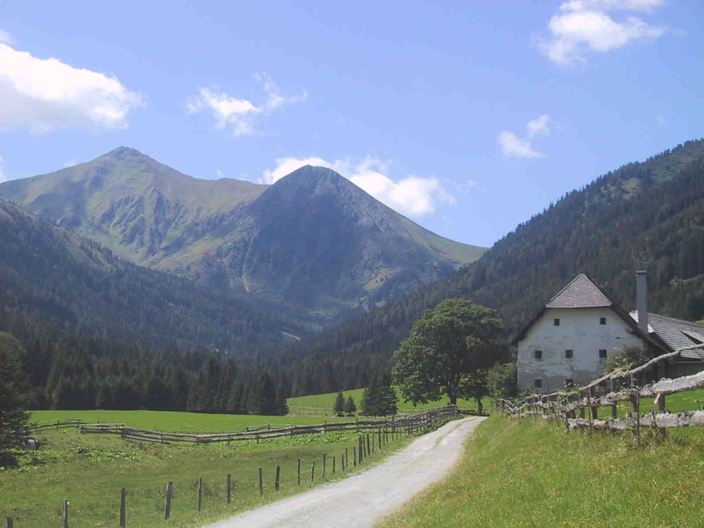

use `resources/img...` both for the image in the YAML header as for images in the text, as the following experiment shows. 

The \graphicspath{{$extra.webroot$}} is set and webroot is `/home/frank/bakedExperiment/` but none is shown in tufte.html
 
The 1st image:   is referenced absolutely with `/Minimal/resources/1IMG.JPG` shows in html, but not pdf.

test 2nd imgage:  is `Minimal/resources/2IMG.JPG` is incorrect relative reference and therefore not shown in HTML nor PDF - if graphicspath is set (otherwise perhaps shown interpreted relative to cwd). 

test 3rd image:   is `resources/3IMG.JPG` is  relative reference to position of .md file. shown in HTML and in PDF if `graphicspath` is set. 
